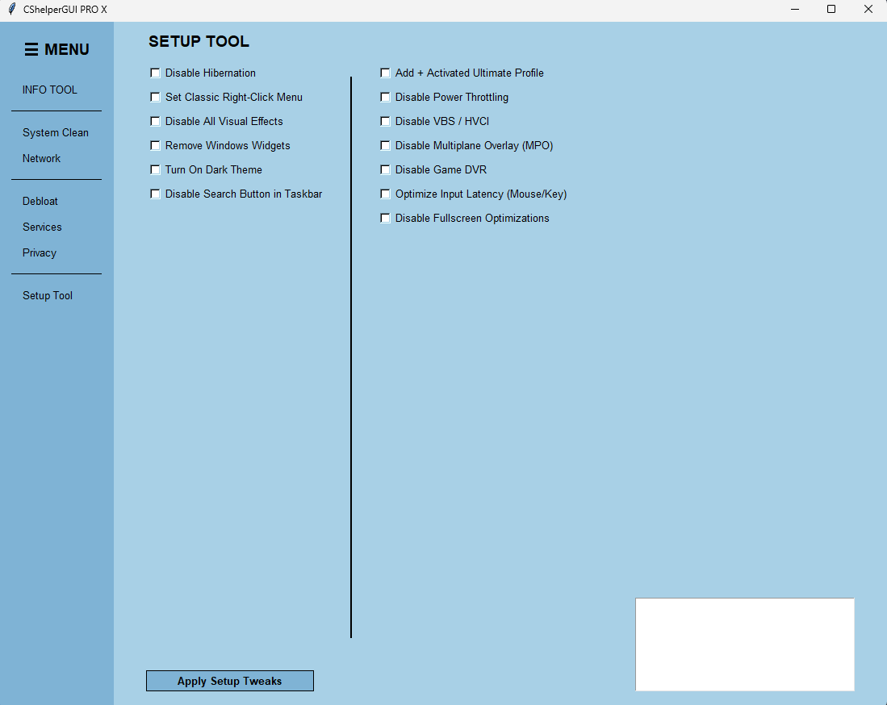

# 
🚀 CShelper-PRO-X

  
  
  

  

  <strong>Advanced Windows Optimization Tool for Maximum Gaming Performance and System Stability.</strong>

---

### 🛠 What is CShelper-PRO-X?
**CShelper-PRO-X** is a lightweight, all-in-one utility designed to strip away Windows bloat, optimize network latency, and fine-tune system services. Inspired by projects like AtlasOS, it brings professional-grade tweaks to a simple, easy-to-use GUI.

---

### 🔥 Key Features
*   **💻 INFO TOOL** - Automatic hardware detection (CPU, GPU, RAM).
*   **🧹 SYSTEM CLEAN** - Deep cleaning of shader cache, temp files, and update logs.
*   **🌐 NETWORK** - TCP/IP resets and DNS flushing for lower ping.
*   **🛡️ DEBLOAT** - One-click removal of OneDrive, Xbox, and Telemetry.
*   **⚡ SERVICES** - 25+ essential service tweaks (AtlasOS inspired).
*   **🔒 PRIVACY** - Stop Windows from spying and tracking your activities.
*   **⚙️ SETUP TOOL** - Ultimate Power Plan, VBS/HVCI disable, and Input Lag fixes.

---

### ⚠️ Safety First
> **Warning:** Optimization involves system changes. Always use the **"Restore Point"** button before applying tweaks.

---

### 📦 How to Download
 Click on the **[Download CShelper PRO X](https://github.com/d0messChecker/CShelper-PRO-X/releases/tag/v1.0.0)** button.
 Download the latest `CShelperPRO.exe`.
Run as **Administrator** and enjoy!
